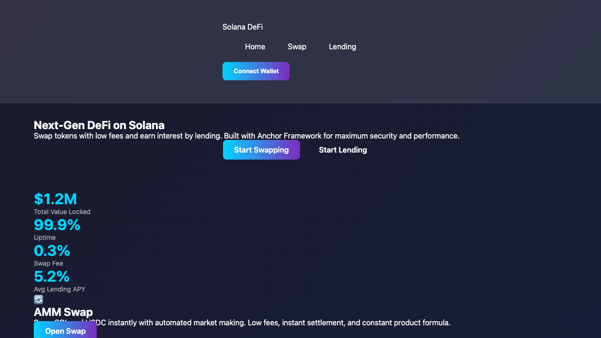
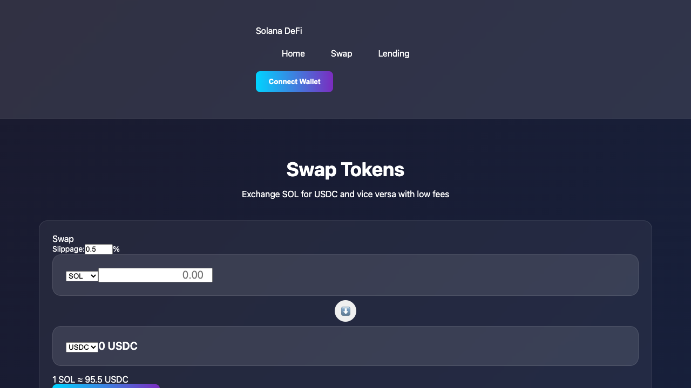
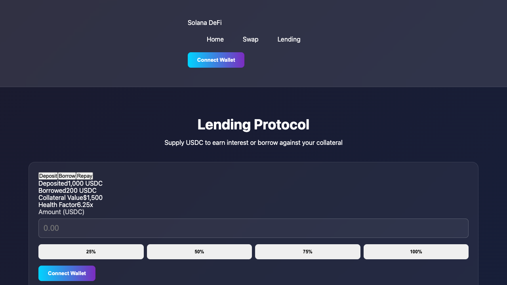
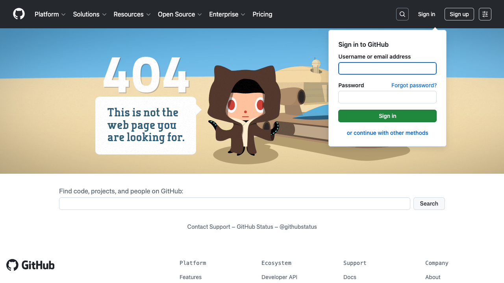

# Solana DeFi AMM + Lending Protocol

## 💻 项目 Repo

https://github.com/truongvknnlthao-gif/solana-defi-amm-lending

## 📌 项目简介

这是一个基于 Solana 区块链的组合型 DeFi 协议，包含两个核心模块：

**AMM（自动做市商）：**
- 支持代币兑换（Swap）
- 流动性注入/提取
- LP Token 铸造与赎回

**Lending（借贷协议）：**
- 存款赚取利息
- 抵押借款
- 简化版实现（无清算）

项目解决了 DeFi 用户对去中心化交易和借贷的需求，提供透明、低费用的金融服务。

## 🛠️ 技术栈

- 智能合约：Rust + Anchor Framework 0.32.1
- 前端：Next.js + TypeScript + Wallet Adapter
- 测试：Anchor Test + Solana Test Validator
- 工具：Solana CLI 4.0.0 (Agave), Rust 1.95.0-nightly

## 🎬 Demo 演示

### 演示链接
- 🎥 视频演示：待上传
- 🌐 在线 Demo：本地测试网 (localhost:3000)

### 功能截图

*首页 - 展示协议总览和模块入口*

*Swap 页面 - AMM 代币兑换界面*

*Lending 页面 - 借贷协议界面*

*GitHub 仓库 - 项目代码和文档*

## 💡 核心功能

1. **AMM Swap**：去中心化代币兑换，使用恒定乘积公式 (K=x*y)
2. **流动性管理**：添加/移除流动性，获取 LP Token
3. **Lending Deposit**：存入代币，赚取收益
4. **Lending Borrow**：抵押存款，借出其他代币
5. **Wallet 连接**：支持 Solana 钱包适配器

## ✍️ 项目创作者

1. 创作者昵称：BY
2. 创作者联系方式：[Telegram @HeyWhiteBY](https://t.me/HeyWhiteBY)
3. 创作者 Solana USDC 钱包地址：9iL8XQHHQmtWojmFHsMj9cTZtMhSShwrX72TDDTGt9gy
